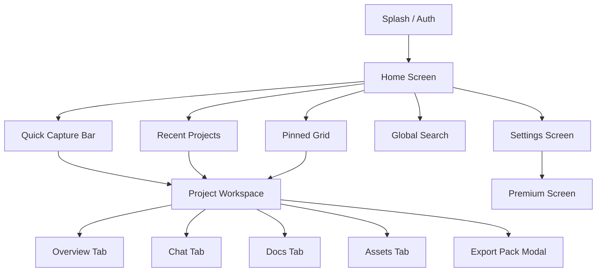

# ThinkNest Mobile Screen Map

**Version:** 1.0  
**Status:** Approved  
**Scope:** Screen Flow & Route Hierarchy

---

## 1. Route Navigation Diagram

---

## 2. Screen Inventory List

1. **`SCR_001_HOME`:** Main entry screen with sticky Quick Capture bar and project grid.
2. **`SCR_002_PROJECT_MAIN`:** Multi-tab project hub (Overview, Conversation, Documents, Assets).
3. **`SCR_003_CONVERSATION`:** Active Grill-me chat interface with voice streaming and specialist badges.
4. **`SCR_004_DOC_VIEWER`:** Fullscreen Markdown document viewer/editor with export actions.
5. **`SCR_005_SEARCH`:** Global search with instant fuzzy match filtering across titles, DNA, and transcripts.
6. **`SCR_006_SETTINGS`:** User profile, AI provider configuration, API keys, local database backup.
7. **`SCR_007_PREMIUM`:** Subscription tier showcase, usage limits, specialist unlocks.
