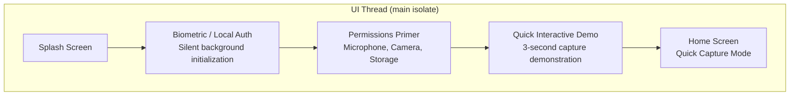
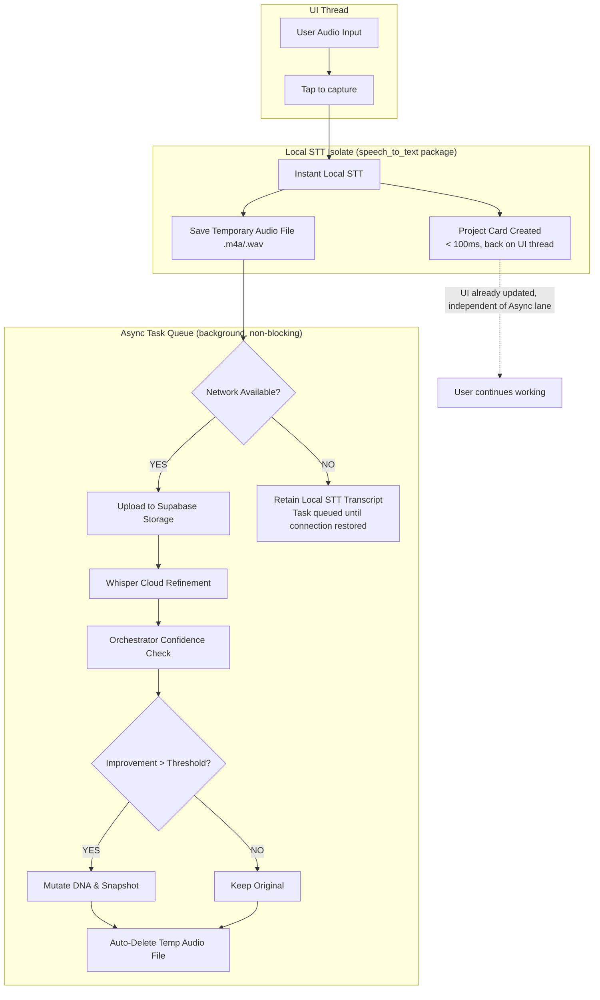
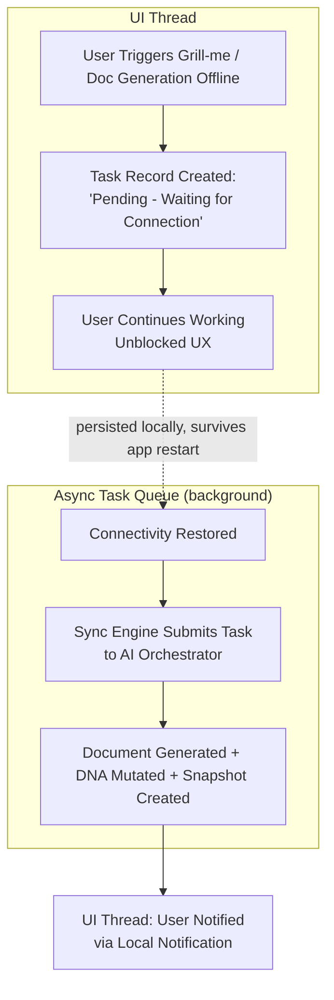

# ThinkNest Product Flow

**Version:** 1.3
**Status:** Approved  
**Target Platform:** Flutter (Android & Web for V1, iOS for V2)
**Changelog:** v1.3 separa explicitamente, em cada fluxo, o que executa na UI thread do que executa em isolate/worker assíncrono (a v1.2 misturava os dois níveis no mesmo grafo sem fronteira visual, achado de clareza da auditoria de 2026-07-29). Também corrige a discrepância entre a versão auditada em texto plano e a versão real do arquivo, que já usa sintaxe Mermaid graph TD.

---

## 1. Onboarding & First Launch Flow

A experiência de onboarding roda inteiramente na UI thread — não há trabalho assíncrono relevante neste fluxo.

## 2. Quick Capture & Audio Refinement Flow (ADR #7)

Este fluxo cruza três contextos de execução distintos: UI thread, um isolate local de STT, e chamadas de rede assíncronas. A v1.2 apresentava os três nós lado a lado sem indicar a fronteira — um engenheiro de frontend não conseguia saber, só pelo diagrama, onde o upload era disparado. Corrigido abaixo com subgraph por contexto de execução:

**Contrato explícito por camada:**

*   **UI Thread:** apenas captura o toque/áudio e renderiza o Project Card assim que o isolate local retorna (<100ms). Nunca bloqueia esperando rede.
*   **Local STT Isolate:** roda via `compute()`/isolate dedicado do pacote `speech_to_text`; não tem acesso a rede.
*   **Async Task Queue:** gerenciada pelo sync engine (ver `03_Offline_Synchronization.md`); todo o ramo de upload/Whisper/mutação de DNA é desacoplado da árvore de widgets e pode ser interrompido/retomado sem afetar a UI.

## 3. Asynchronous Offline AI Tasks Flow (ADR #8)

**Contrato explícito por camada:** o TaskRecord é persistido no Drift local antes de qualquer tentativa de rede, garantindo que o registro sobrevive a fechamento do app; a UI nunca aguarda o SyncEngine de forma síncrona.
