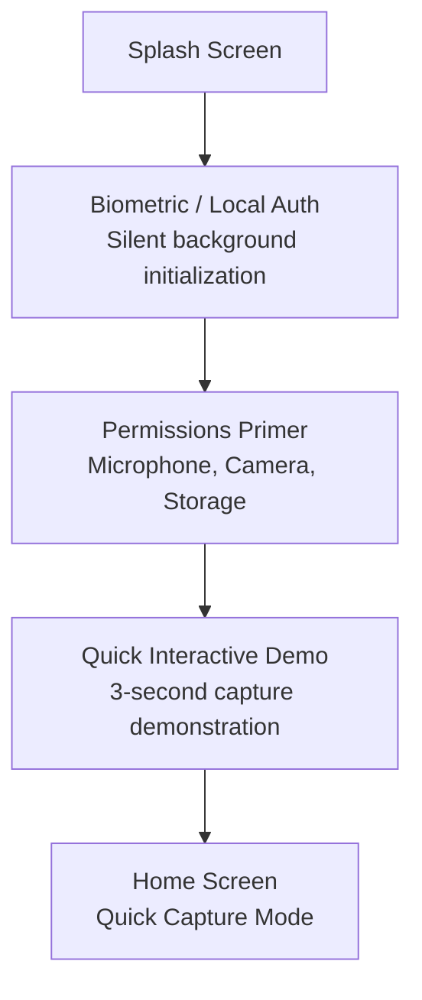
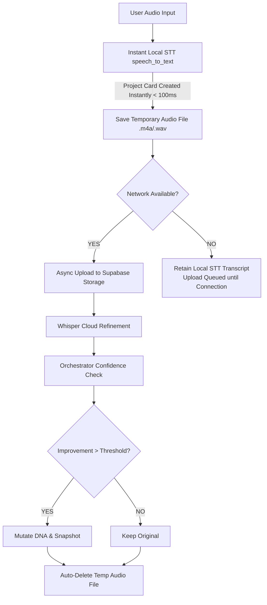
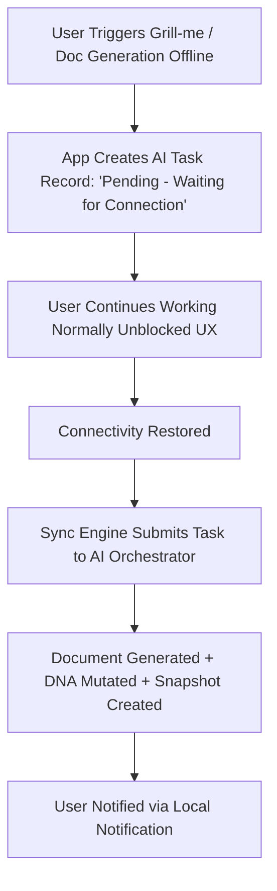

# ThinkNest Product Flow

**Version:** 1.2  
**Status:** Approved  
**Target Platform:** Flutter (Android & Web for V1, iOS for V2)

---

## 1. Onboarding & First Launch Flow

The onboarding experience prioritizes immediate value delivery with zero-friction entry points.

---

## 2. Quick Capture & Audio Refinement Flow (ADR #7)

Idea capture is the foundational entry point of ThinkNest.

---

## 3. Asynchronous Offline AI Tasks Flow (ADR #8)

